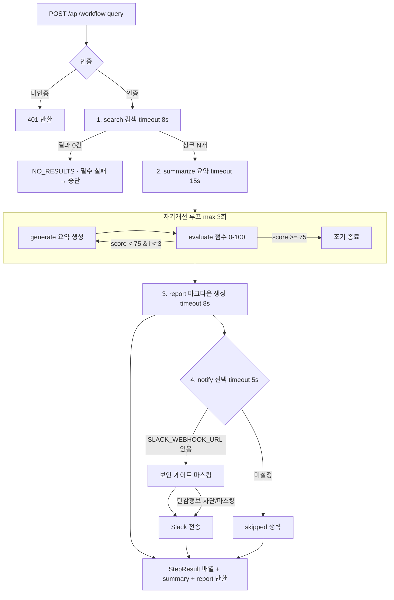

# 워크플로 다이어그램 (Day13 산출물)

검색 → 요약(자기개선 루프) → 리포트 → (선택)알림. 필수 단계 실패 시 중단, 선택 단계 실패는 계속.

- **필수**: search, summarize, report (실패 시 이후 중단)
- **선택**: notify (실패해도 워크플로 성공)
- 각 단계는 `Promise.race` 타임아웃, 결과는 `StepResult{stepName,status,durationMs,errorCode,outputSummary}`로 통일.
